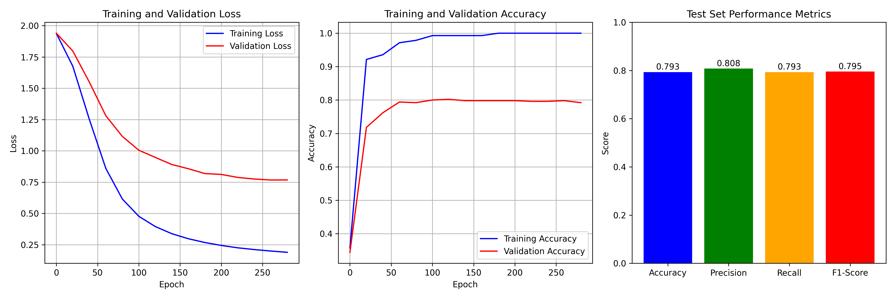

# GCN Model Training Report

## 1. Experimental Environment
- **Device**: CUDA

## 2. Dataset Information
- **Dataset**: Cora
- **Number of nodes**: 2708
- **Number of edges**: 10556
- **Feature dimensions**: 1433
- **Number of classes**: 7
- **Training nodes**: 140
- **Validation nodes**: 500
- **Test nodes**: 1000

## 3. Model Architecture
```python
GCN(
  (conv1): GCNConv(1433, 16)
  (conv2): GCNConv(16, 7)
)
```
- **Total parameters**: 23063
- **Hyperparameters**: Learning rate=0.01, dropout=0.5, epochs=200

## 4. Training Process
| Epoch | Training Loss | Training Accuracy | Validation Loss | Validation Accuracy |
|-------|---------------|-------------------|-----------------|---------------------|
| 0     | 1.9464        | 0.3000            | 1.9430          | 0.2560              |
| 20    | 1.7075        | 0.9643            | 1.8116          | 0.7460              |
| 40    | 1.3244        | 0.9643            | 1.5569          | 0.7800              |
| 60    | 0.8751        | 0.9786            | 1.2944          | 0.7700              |
| 80    | 0.6591        | 0.9857            | 1.1076          | 0.7860              |
| 100   | 0.5547        | 0.9857            | 0.9917          | 0.7820              |
| 120   | 0.4557        | 0.9929            | 0.9159          | 0.7900              |
| 140   | 0.4039        | 0.9929            | 0.8737          | 0.7900              |
| 160   | 0.3687        | 1.0000            | 0.8410          | 0.7920              |
| 180   | 0.3319        | 0.9929            | 0.8244          | 0.7860              |

- **Training time**: 1.10 seconds

## 5. Test Set Performance Metrics
- **Test Loss**: 0.7739
- **Test Accuracy**: 0.8060
- **Precision**: 0.8145
- **Recall**: 0.8060
- **F1-Score**: 0.8080

### 5.1 Per-class Classification Report
| Class                  | precision | recall | f1-score | support |
| ---------------------- | --------- | ------ | -------- | ------- |
| Case Based             | 0.65      | 0.80   | 0.72     | 130     |
| Genetic Algorithms     | 0.79      | 0.86   | 0.82     | 91      |
| Neural Networks        | 0.88      | 0.88   | 0.88     | 144     |
| Probabilistic Methods  | 0.89      | 0.79   | 0.84     | 319     |
| Reinforcement Learning | 0.82      | 0.80   | 0.81     | 149     |
| Rule Learning          | 0.79      | 0.75   | 0.77     | 103     |
| Theory                 | 0.68      | 0.77   | 0.72     | 64      |
| accuracy               |           |        | 0.81     | 1000    |
| macro avg              | 0.79      | 0.81   | 0.79     | 1000    |
| weighted avg           | 0.81      | 0.81   | 0.81     | 1000    |


## 6. Performance Visualization


## 7. Conclusion
The model achieved 80.60% test accuracy and 80.80% F1-score on the Cora dataset. The training process was stable, with validation performance plateauing in the later training stages.

## Appendix: Complete Source Code
```python
import torch
import torch.nn as nn
import torch.nn.functional as F
from torch_geometric.nn import GCNConv
from torch_geometric.datasets import Planetoid
from torch_geometric.transforms import NormalizeFeatures
import matplotlib.pyplot as plt
import numpy as np
from sklearn.metrics import accuracy_score, precision_recall_fscore_support, classification_report
import time

# Set device
device = torch.device('cuda' if torch.cuda.is_available() else 'cpu')
print(f"Using device: {device}")

# Load and preprocess the Cora dataset
print("Loading Cora dataset...")
dataset = Planetoid(root='data/Cora', name='Cora', transform=NormalizeFeatures())
data = dataset[0].to(device)

print(f"Dataset: {dataset}")
print(f"Number of nodes: {data.x.shape[0]}")
print(f"Number of edges: {data.edge_index.shape[1]}")
print(f"Number of features: {data.x.shape[1]}")
print(f"Number of classes: {dataset.num_classes}")
print(f"Training nodes: {data.train_mask.sum()}")
print(f"Validation nodes: {data.val_mask.sum()}")
print(f"Test nodes: {data.test_mask.sum()}")

class GCN(nn.Module):
    def __init__(self, input_dim, hidden_dim, output_dim, dropout=0.5):
        super(GCN, self).__init__()
        self.conv1 = GCNConv(input_dim, hidden_dim)
        self.conv2 = GCNConv(hidden_dim, output_dim)
        self.dropout = dropout
        
    def forward(self, x, edge_index):
        x = self.conv1(x, edge_index)
        x = F.relu(x)
        x = F.dropout(x, p=self.dropout, training=self.training)
        x = self.conv2(x, edge_index)
        return F.log_softmax(x, dim=1)

# Model hyperparameters
input_dim = dataset.num_node_features
hidden_dim = 16
output_dim = dataset.num_classes
learning_rate = 0.01
dropout = 0.5
epochs = 200

# Initialize model, loss function, and optimizer
model = GCN(input_dim, hidden_dim, output_dim, dropout).to(device)
criterion = nn.NLLLoss()
optimizer = torch.optim.Adam(model.parameters(), lr=learning_rate, weight_decay=5e-4)

print(f"\nModel architecture:")
print(model)
print(f"Total parameters: {sum(p.numel() for p in model.parameters())}")

# Training loop with logging
def train():
    model.train()
    optimizer.zero_grad()
    out = model(data.x, data.edge_index)
    loss = criterion(out[data.train_mask], data.y[data.train_mask])
    loss.backward()
    optimizer.step()
    return loss.item()

def evaluate(mask):
    model.eval()
    with torch.no_grad():
        out = model(data.x, data.edge_index)
        pred = out.argmax(dim=1)
        correct = (pred[mask] == data.y[mask]).float().sum()
        accuracy = correct / mask.sum()
        loss = criterion(out[mask], data.y[mask])
    return loss.item(), accuracy.item()

# Training history
train_losses = []
val_losses = []
train_accuracies = []
val_accuracies = []

print("\nStarting training...")
start_time = time.time()

for epoch in range(epochs):
    # Training
    train_loss = train()
    
    # Evaluation every 20 epochs
    if epoch % 20 == 0:
        train_loss_eval, train_acc = evaluate(data.train_mask)
        val_loss, val_acc = evaluate(data.val_mask)
        
        train_losses.append(train_loss_eval)
        val_losses.append(val_loss)
        train_accuracies.append(train_acc)
        val_accuracies.append(val_acc)
        
        print(f'Epoch {epoch:03d}: Train Loss: {train_loss:.4f}, Train Acc: {train_acc:.4f}, '
              f'Val Loss: {val_loss:.4f}, Val Acc: {val_acc:.4f}')

training_time = time.time() - start_time
print(f"\nTraining completed in {training_time:.2f} seconds")

# Final evaluation on test set
test_loss, test_acc = evaluate(data.test_mask)
print(f"\nTest Results:")
print(f"Test Loss: {test_loss:.4f}")
print(f"Test Accuracy: {test_acc:.4f}")

# Detailed evaluation metrics
model.eval()
with torch.no_grad():
    out = model(data.x, data.edge_index)
    pred = out.argmax(dim=1)
    
    test_pred = pred[data.test_mask].cpu().numpy()
    test_true = data.y[data.test_mask].cpu().numpy()
    
    precision, recall, f1, support = precision_recall_fscore_support(
        test_true, test_pred, average='weighted'
    )
    
    print(f"\nDetailed Test Metrics:")
    print(f"Precision: {precision:.4f}")
    print(f"Recall: {recall:.4f}")
    print(f"F1-Score: {f1:.4f}")
    
    # Per-class metrics
    print(f"\nPer-class Classification Report:")
    class_names = ['Case Based', 'Genetic Algorithms', 'Neural Networks', 
                   'Probabilistic Methods', 'Reinforcement Learning', 
                   'Rule Learning', 'Theory']
    print(classification_report(test_true, test_pred, target_names=class_names))

# Plot training curves
plt.figure(figsize=(15, 5))

# Loss curve
plt.subplot(1, 3, 1)
epochs_logged = list(range(0, epochs, 20))
plt.plot(epochs_logged, train_losses, 'b-', label='Training Loss')
plt.plot(epochs_logged, val_losses, 'r-', label='Validation Loss')
plt.xlabel('Epoch')
plt.ylabel('Loss')
plt.title('Training and Validation Loss')
plt.legend()
plt.grid(True)

# Accuracy curve
plt.subplot(1, 3, 2)
plt.plot(epochs_logged, train_accuracies, 'b-', label='Training Accuracy')
plt.plot(epochs_logged, val_accuracies, 'r-', label='Validation Accuracy')
plt.xlabel('Epoch')
plt.ylabel('Accuracy')
plt.title('Training and Validation Accuracy')
plt.legend()
plt.grid(True)

# Final performance comparison
plt.subplot(1, 3, 3)
metrics = ['Accuracy', 'Precision', 'Recall', 'F1-Score']
values = [test_acc, precision, recall, f1]
plt.bar(metrics, values, color=['blue', 'green', 'orange', 'red'])
plt.ylabel('Score')
plt.title('Test Set Performance Metrics')
plt.ylim(0, 1)
for i, v in enumerate(values):
    plt.text(i, v + 0.01, f'{v:.3f}', ha='center')

plt.tight_layout()
plt.show()
plt.savefig('performance_metrics.png', dpi=300)
plt.close()

# Save training logs
training_log = {
    'epochs': epochs_logged,
    'train_losses': train_losses,
    'val_losses': val_losses,
    'train_accuracies': train_accuracies,
    'val_accuracies': val_accuracies,
    'test_accuracy': test_acc,
    'test_precision': precision,
    'test_recall': recall,
    'test_f1': f1
}

print(f"\nTraining completed successfully!")
print(f"Model achieved {test_acc:.4f} test accuracy with F1-score of {f1:.4f}")
```
