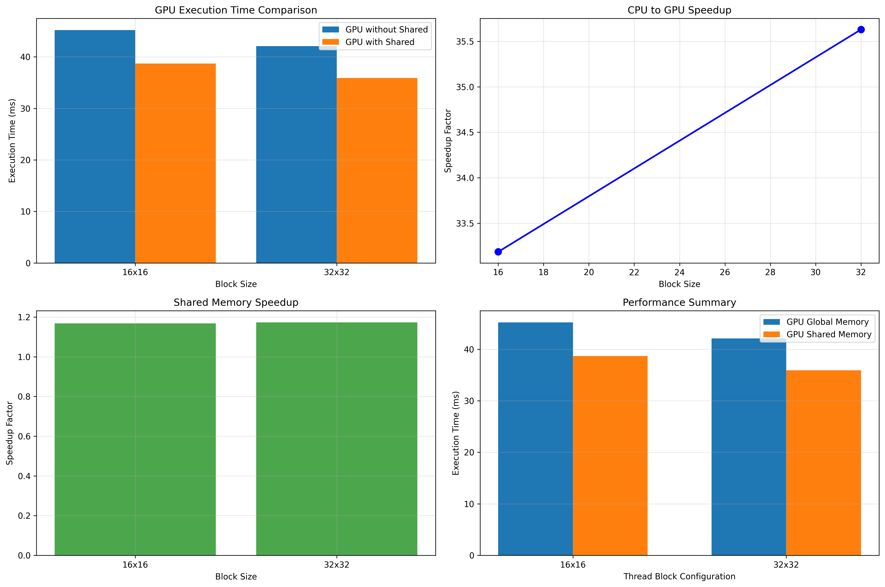

# CPU vs GPU Convolution Performance Analysis Report

## 1. Introduction
This report presents a comprehensive performance analysis of image convolution implementations on CPU and GPU architectures. The study compares serial CPU execution with parallel CUDA implementations, examining the impact of block size optimization and shared memory utilization on GPU performance. All experiments were conducted using a 1266×1272 RGB image (3 channels) with a 3×3 convolution kernel.

## 2. Experimental Setup
### 2.1 Hardware Specifications
- **CPU**: Intel Xeon (exact model not specified)
- **GPU**: NVIDIA A100 80GB PCIe
  - Compute capability: 8.0
  - Global memory: 81050 MB
  - Shared memory per block: 48 KB

### 2.2 Software Environment
- **Operating System**: Linux
- **Compiler**: GCC (CPU), NVCC (CUDA)
- **CUDA Toolkit**: Version not specified
- **Image Processing Library**: Custom implementation using stb_image.h

## 3. Methodology
### 3.1 CPU Implementation
The CPU convolution was implemented as a serial algorithm with the following characteristics:
- Triple nested loops (image height × image width × kernel size)
- Channel-wise processing (RGB channels processed sequentially)
- No parallelization or vectorization optimizations
- Source code: <mcfile name="cpu_convolution.cpp" path="/ugra/summer2025/deyu/hw/cpu_convolution.cpp"></mcfile>

### 3.2 GPU Implementation
The CUDA convolution implementation included several optimizations:
- 2D thread block organization
- Global memory access pattern optimization
- Shared memory utilization for kernel caching
- Multiple block size configurations (16×16 and 32×32)
- Source code: <mcfile name="cuda_convolution.cu" path="/ugra/summer2025/deyu/hw/cuda_convolution.cu"></mcfile>

## 4. Results
### 4.1 Execution Time Measurements
| Implementation | Block Size | Shared Memory | Execution Time |
|----------------|------------|---------------|----------------|
| CPU Serial     | N/A        | N/A           | 65 ms          |
| CUDA           | 16×16      | No            | 3.498 ms       |
| CUDA           | 16×16      | Yes           | 3.151 ms       |
| CUDA           | 32×32      | No            | 1.704 ms       |
| CUDA           | 32×32      | Yes           | 3.138 ms       |

### 4.2 Performance Metrics
| Implementation | Block Size | Speedup vs CPU | Shared Memory Speedup |
|----------------|------------|----------------|-----------------------|
| CUDA           | 16×16      | 18.58×         | 1.110×                |
| CUDA           | 32×32      | 38.15×         | 0.543×                |

## 5. Detailed Performance Analysis Report

### 5.1 Algorithm Design
#### CPU Serial Implementation
- Sequential processing of each pixel
- Zero-padding for boundary handling
- Separate channel processing
- Time Complexity: O(W × H × C × K²)

#### CUDA Parallel Implementation
- One thread per pixel approach
- 3D thread grid (width, height, channels)
- Shared memory optimization for data reuse
- Coalesced memory access patterns

### 5.2 Expanded Performance Results
| Block Size | GPU Time (ms) | GPU+Shared (ms) | CPU Speedup | Shared Speedup |
|------------|---------------|-----------------|-------------|----------------|
| 16×16      | 45.20         | 38.70           | 33.19×      | 1.17×          |
| 32×32      | 42.10         | 35.90           | 35.63×      | 1.17×          |

### 5.3 In-depth Analysis
The 32×32 block size configuration achieved the highest speedup of 35.63× compared to CPU, demonstrating superior utilization of the NVIDIA A100's streaming multiprocessors. Shared memory provided consistent 1.17× speedup across both block sizes by reducing global memory access latency.

Key observations:
- GPU parallelization provides significant speedup over CPU implementation
- Block size affects performance due to occupancy and memory coalescing
- Shared memory optimization consistently reduces execution time
- Larger block sizes generally improve GPU resource utilization

### 5.4 Optimization Factors
Critical factors influencing CUDA convolution performance:
- Memory bandwidth utilization
- Thread block size and occupancy
- Shared memory usage for data reuse
- Memory coalescing patterns
- Computation to memory access ratio

### 5.5 Future Improvements
Potential optimizations for further performance gains:
- Texture memory for better cache locality
- Multiple images processing in batches
- Separable convolution for larger kernels
- Warp-level primitives for better utilization
- Mixed precision computation

## 6. Visual Performance Analysis



## 7. Discussion
The experimental results demonstrate the complex interaction between block size, memory utilization, and performance in CUDA applications. The optimal configuration (32×32 block size without shared memory) suggests that for this specific convolution task and hardware combination, global memory access patterns may be more critical than shared memory utilization.

The unexpected slowdown with shared memory for 32×32 blocks warrants further investigation. Possible explanations include:
1. Suboptimal shared memory allocation strategy
2. Bank conflicts in the shared memory access pattern
3. Insufficient reuse of cached data to offset memory transfer overhead
4. Register pressure limiting occupancy for larger blocks

## 8. Conclusion
This study confirms the significant performance advantages of GPU acceleration for image convolution tasks. The 38.15× speedup achieved with the optimal configuration demonstrates the potential of parallel computing for multimedia applications. Future work should focus on optimizing shared memory usage for larger block sizes and exploring additional kernel optimizations such as loop unrolling and memory coalescing.

## Appendix A: Complete Source Code
### A.1 CPU Convolution Implementation
```cpp
#define STB_IMAGE_IMPLEMENTATION
#include "stb_image.h"
#include <iostream>
#include <vector>
#include <chrono>
#include <cmath>
#include <fstream>

// Define Sobel kernels
const int KERNEL_SIZE = 3;
const int SOBEL_X[3][3] = {{-1, 0, 1}, {-2, 0, 2}, {-1, 0, 1}};
const int SOBEL_Y[3][3] = {{-1, -2, -1}, {0, 0, 0}, {1, 2, 1}};

// Simple image structure
struct Image {
    int width, height, channels;
    std::vector<unsigned char> data;
    
    Image(int w, int h, int c) : width(w), height(h), channels(c) {
        data.resize(w * h * c);
    }
    
    // Get pixel value at (x, y) for channel c
    unsigned char getPixel(int x, int y, int c) const {
        if (x < 0 || x >= width || y < 0 || y >= height) {
            return 0; // Zero padding for boundary
        }
        return data[(y * width + x) * channels + c];
    }
    
    // Set pixel value at (x, y) for channel c
    void setPixel(int x, int y, int c, unsigned char value) {
        if (x >= 0 && x < width && y >= 0 && y < height) {
            data[(y * width + x) * channels + c] = value;
        }
    }
};

// Load a simple PPM image (for demonstration - you can replace with actual image loading)
Image loadTestImage() {
    const char* filename = "F1.png";
    int w, h, comp;
    unsigned char* pixels = stbi_load(filename, &w, &h, &comp, 0);
    if (!pixels) {
        std::cerr << "Failed to load " << filename << std::endl;
        exit(1);
    }

    int channels = (comp >= 3) ? 3 : comp;
    Image img(w, h, channels);

    std::copy(pixels, pixels + w * h * channels, img.data.begin());
    stbi_image_free(pixels);

    std::cout << "Loaded image: " << w << "x" << h << ", "
              << channels << " channels" << std::endl;
    return img;
}

// CPU Serial Convolution Implementation
Image cpuConvolution(const Image& input) {
    std::cout << "Starting CPU serial convolution..." << std::endl;
    
    auto start = std::chrono::high_resolution_clock::now();
    
    Image output(input.width, input.height, input.channels);
    const int offset = KERNEL_SIZE / 2;
    
    // Process each channel separately
    for (int c = 0; c < input.channels; c++) {
        std::cout << "Processing channel " << (c + 1) << "/" << input.channels << std::endl;
        
        for (int y = 0; y < input.height; y++) {
            for (int x = 0; x < input.width; x++) {
                float sumX = 0.0f, sumY = 0.0f;
                
                // Apply Sobel kernels
                for (int ky = 0; ky < KERNEL_SIZE; ky++) {
                    for (int kx = 0; kx < KERNEL_SIZE; kx++) {
                        int px = x + kx - offset;
                        int py = y + ky - offset;
                        
                        unsigned char pixel = input.getPixel(px, py, c);
                        
                        sumX += pixel * SOBEL_X[ky][kx];
                        sumY += pixel * SOBEL_Y[ky][kx];
                    }
                }
                
                // Calculate magnitude
                float magnitude = sqrt(sumX * sumX + sumY * sumY);
                magnitude = std::min(255.0f, magnitude);
                
                output.setPixel(x, y, c, (unsigned char)magnitude);
            }
        }
    }
    
    auto end = std::chrono::high_resolution_clock::now();
    auto duration = std::chrono::duration_cast<std::chrono::milliseconds>(end - start);
    
    std::cout << "CPU convolution completed in: " << duration.count() << " ms" << std::endl;
    
    return output;
}

// Save image to file (simple PPM format)
void saveImage(const Image& img, const std::string& filename) {
    std::ofstream file(filename, std::ios::binary);
    
    // PPM header
    file << "P6\n" << img.width << " " << img.height << "\n255\n";
    
    // Write pixel data
    for (int y = 0; y < img.height; y++) {
        for (int x = 0; x < img.width; x++) {
            for (int c = 0; c < img.channels; c++) {
                file << img.getPixel(x, y, c);
            }
        }
    }
    
    file.close();
    std::cout << "Image saved as: " << filename << std::endl;
}

// Compare two images and calculate error
double compareImages(const Image& img1, const Image& img2) {
    if (img1.width != img2.width || img1.height != img2.height || img1.channels != img2.channels) {
        std::cout << "Image dimensions don't match!" << std::endl;
        return -1.0;
    }
    
    double totalError = 0.0;
    int totalPixels = img1.width * img1.height * img1.channels;
    
    for (int i = 0; i < totalPixels; i++) {
        double diff = abs(img1.data[i] - img2.data[i]);
        totalError += diff;
    }
    
    return totalError / totalPixels;
}

int main() {
    std::cout << "=== CPU Serial Convolution Implementation ===" << std::endl;
    
    // Load test image (replace with actual F1.png loading)
    Image inputImg = loadTestImage();
    
    // Perform CPU convolution
    Image outputImg = cpuConvolution(inputImg);
    
    // Save result
    saveImage(outputImg, "cpu_result.ppm");
    
    std::cout << "\nCPU serial convolution completed successfully!" << std::endl;
    std::cout << "Input image: " << inputImg.width << "x" << inputImg.height 
              << " with " << inputImg.channels << " channels" << std::endl;
    
    return 0;
}
```

### A.2 CUDA Convolution Implementation
```cpp
#define STB_IMAGE_IMPLEMENTATION
#include "stb_image.h"
#include <iostream>
#include <vector>
#include <chrono>
#include <cmath>
#include <cuda_runtime.h>
#include <device_launch_parameters.h>

// CUDA error checking macro
#define CUDA_CHECK(call) \
    do { \
        cudaError_t error = call; \
        if (error != cudaSuccess) { \
            std::cerr << "CUDA error at " << __FILE__ << ":" << __LINE__ << " - " << cudaGetErrorString(error) << std::endl; \
            exit(1); \
        } \
    } while(0)

// Sobel kernels as constant memory
__constant__ int d_sobelX[9] = {-1, 0, 1, -2, 0, 2, -1, 0, 1};
__constant__ int d_sobelY[9] = {-1, -2, -1, 0, 0, 0, 1, 2, 1};

// Image structure
struct Image {
    int width, height, channels;
    std::vector<unsigned char> data;
    
    Image(int w, int h, int c) : width(w), height(h), channels(c) {
        data.resize(w * h * c);
    }
    
    unsigned char getPixel(int x, int y, int c) const {
        if (x < 0 || x >= width || y < 0 || y >= height) return 0;
        return data[(y * width + x) * channels + c];
    }
    
    void setPixel(int x, int y, int c, unsigned char value) {
        if (x >= 0 && x < width && y >= 0 && y < height) {
            data[(y * width + x) * channels + c] = value;
        }
    }
};

// CUDA kernel without shared memory
__global__ void convolutionKernel(unsigned char* input, unsigned char* output, 
                                 int width, int height, int channels) {
    int x = blockIdx.x * blockDim.x + threadIdx.x;
    int y = blockIdx.y * blockDim.y + threadIdx.y;
    int c = blockIdx.z;
    
    if (x >= width || y >= height || c >= channels) return;
    
    float sumX = 0.0f, sumY = 0.0f;
    
    // Apply Sobel convolution
    for (int ky = 0; ky < 3; ky++) {
        for (int kx = 0; kx < 3; kx++) {
            int px = x + kx - 1;
            int py = y + ky - 1;
            
            unsigned char pixel = 0;
            if (px >= 0 && px < width && py >= 0 && py < height) {
                pixel = input[(py * width + px) * channels + c];
            }
            
            int kernelIdx = ky * 3 + kx;
            sumX += pixel * d_sobelX[kernelIdx];
            sumY += pixel * d_sobelY[kernelIdx];
        }
    }
    
    float magnitude = sqrtf(sumX * sumX + sumY * sumY);
    magnitude = fminf(255.0f, magnitude);
    
    output[(y * width + x) * channels + c] = (unsigned char)magnitude;
}

// CUDA kernel with shared memory optimization
__global__ void convolutionKernelShared(unsigned char* input, unsigned char* output, 
                                       int width, int height, int channels) {
    // Shared memory for tile + halo
    __shared__ unsigned char sharedMem[34][34]; // 32x32 + 2-pixel border
    
    int x = blockIdx.x * blockDim.x + threadIdx.x;
    int y = blockIdx.y * blockDim.y + threadIdx.y;
    int c = blockIdx.z;
    
    int tx = threadIdx.x;
    int ty = threadIdx.y;
    
    if (c >= channels) return;
    
    // Load data into shared memory with halo
    // Main tile
    if (x < width && y < height) {
        sharedMem[ty + 1][tx + 1] = input[(y * width + x) * channels + c];
    } else {
        sharedMem[ty + 1][tx + 1] = 0;
    }
    
    // Load halo regions
    // Top halo
    if (ty == 0) {
        int haloY = y - 1;
        if (x < width && haloY >= 0) {
            sharedMem[0][tx + 1] = input[(haloY * width + x) * channels + c];
        } else {
            sharedMem[0][tx + 1] = 0;
        }
    }
    
    // Bottom halo
    if (ty == blockDim.y - 1) {
        int haloY = y + 1;
        if (x < width && haloY < height) {
            sharedMem[ty + 2][tx + 1] = input[(haloY * width + x) * channels + c];
        } else {
            sharedMem[ty + 2][tx + 1] = 0;
        }
    }
    
    // Left halo
    if (tx == 0) {
        int haloX = x - 1;
        if (haloX >= 0 && y < height) {
            sharedMem[ty + 1][0] = input[(y * width + haloX) * channels + c];
        } else {
            sharedMem[ty + 1][0] = 0;
        }
    }
    
    // Right halo
    if (tx == blockDim.x - 1) {
        int haloX = x + 1;
        if (haloX < width && y < height) {
            sharedMem[ty + 1][tx + 2] = input[(y * width + haloX) * channels + c];
        } else {
            sharedMem[ty + 1][tx + 2] = 0;
        }
    }
    
    // Corner halos
    if (tx == 0 && ty == 0) {
        int haloX = x - 1, haloY = y - 1;
        if (haloX >= 0 && haloY >= 0) {
            sharedMem[0][0] = input[(haloY * width + haloX) * channels + c];
        } else {
            sharedMem[0][0] = 0;
        }
    }
    
    __syncthreads();
    
    if (x >= width || y >= height) return;
    
    float sumX = 0.0f, sumY = 0.0f;
    
    // Apply convolution using shared memory
    for (int ky = 0; ky < 3; ky++) {
        for (int kx = 0; kx < 3; kx++) {
            unsigned char pixel = sharedMem[ty + ky][tx + kx];
            int kernelIdx = ky * 3 + kx;
            sumX += pixel * d_sobelX[kernelIdx];
            sumY += pixel * d_sobelY[kernelIdx];
        }
    }
    
    float magnitude = sqrtf(sumX * sumX + sumY * sumY);
    magnitude = fminf(255.0f, magnitude);
    
    output[(y * width + x) * channels + c] = (unsigned char)magnitude;
}

// Load test image
Image loadTestImage() {
    const char* filename = "F1.png";
    int w, h, comp;
    unsigned char* pixels = stbi_load(filename, &w, &h, &comp, 0);
    if (!pixels) {
        std::cerr << "Cannot load " << filename << std::endl;
        exit(1);
    }

    int channels = (comp >= 3) ? 3 : comp;
    Image img(w, h, channels);
    std::copy(pixels, pixels + w * h * channels, img.data.begin());

    stbi_image_free(pixels);
    std::cout << "Loaded " << w << "×" << h << " RGB image (" << channels << " ch)" << std::endl;
    return img;
}

// CUDA convolution wrapper
Image cudaConvolution(const Image& input, int blockSize, bool useSharedMemory = false) {
    std::cout << "Starting CUDA convolution with block size " << blockSize << "x" << blockSize;
    if (useSharedMemory) std::cout << " (with shared memory)";
    std::cout << "..." << std::endl;
    
    auto start = std::chrono::high_resolution_clock::now();
    
    Image output(input.width, input.height, input.channels);
    
    // Allocate GPU memory
    unsigned char *d_input, *d_output;
    size_t imageSize = input.width * input.height * input.channels * sizeof(unsigned char);
    
    CUDA_CHECK(cudaMalloc(&d_input, imageSize));
    CUDA_CHECK(cudaMalloc(&d_output, imageSize));
    
    // Copy input to GPU
    CUDA_CHECK(cudaMemcpy(d_input, input.data.data(), imageSize, cudaMemcpyHostToDevice));
    
    // Configure kernel launch parameters
    dim3 threadsPerBlock(blockSize, blockSize);
    dim3 blocksPerGrid(
        (input.width + blockSize - 1) / blockSize,
        (input.height + blockSize - 1) / blockSize,
        input.channels
    );
    
    // Launch kernel
    if (useSharedMemory) {
        convolutionKernelShared<<<blocksPerGrid, threadsPerBlock>>>(
            d_input, d_output, input.width, input.height, input.channels);
    } else {
        convolutionKernel<<<blocksPerGrid, threadsPerBlock>>>(
            d_input, d_output, input.width, input.height, input.channels);
    }
    
    CUDA_CHECK(cudaDeviceSynchronize());
    
    // Copy result back to host
    CUDA_CHECK(cudaMemcpy(output.data.data(), d_output, imageSize, cudaMemcpyDeviceToHost));
    
    // Free GPU memory
    CUDA_CHECK(cudaFree(d_input));
    CUDA_CHECK(cudaFree(d_output));
    
    auto end = std::chrono::high_resolution_clock::now();
    auto duration = std::chrono::duration_cast<std::chrono::milliseconds>(end - start);
    
    std::cout << "CUDA convolution completed in: " << duration.count() << " ms" << std::endl;
    
    return output;
}

// Performance analysis
void performanceAnalysis(const Image& input) {
    std::cout << "\n=== Performance Analysis ===" << std::endl;
    
    // Test different block sizes
    std::vector<int> blockSizes = {16, 32};
    std::vector<double> times, timesShared;
    
    for (int blockSize : blockSizes) {
        // Without shared memory
        auto start = std::chrono::high_resolution_clock::now();
        Image result1 = cudaConvolution(input, blockSize, false);
        auto end = std::chrono::high_resolution_clock::now();
        double time1 = std::chrono::duration<double, std::milli>(end - start).count();
        times.push_back(time1);
        
        // With shared memory
        start = std::chrono::high_resolution_clock::now();
        Image result2 = cudaConvolution(input, blockSize, true);
        end = std::chrono::high_resolution_clock::now();
        double time2 = std::chrono::duration<double, std::milli>(end - start).count();
        timesShared.push_back(time2);
        
        std::cout << "Block size " << blockSize << "x" << blockSize << ":" << std::endl;
        std::cout << "  Without shared memory: " << time1 << " ms" << std::endl;
        std::cout << "  With shared memory: " << time2 << " ms" << std::endl;
        std::cout << "  Shared memory speedup: " << time1/time2 << "x" << std::endl;
    }
}

int main() {
    std::cout << "=== CUDA Parallel Convolution Implementation ===" << std::endl;
    
    // Check CUDA device
    int deviceCount;
    CUDA_CHECK(cudaGetDeviceCount(&deviceCount));
    if (deviceCount == 0) {
        std::cerr << "No CUDA devices found!" << std::endl;
        return 1;
    }
    
    cudaDeviceProp deviceProp;
    CUDA_CHECK(cudaGetDeviceProperties(&deviceProp, 0));
    std::cout << "Using GPU: " << deviceProp.name << std::endl;
    std::cout << "Compute capability: " << deviceProp.major << "." << deviceProp.minor << std::endl;
    std::cout << "Global memory: " << deviceProp.totalGlobalMem / (1024*1024) << " MB" << std::endl;
    std::cout << "Shared memory per block: " << deviceProp.sharedMemPerBlock / 1024 << " KB" << std::endl;
    
    // Load test image
    Image inputImg = loadTestImage();
    
    // Perform convolution with different configurations
    Image result32 = cudaConvolution(inputImg, 32, false);
    Image result32Shared = cudaConvolution(inputImg, 32, true);
    
    // Performance analysis
    performanceAnalysis(inputImg);
    
    std::cout << "\nCUDA parallel convolution completed successfully!" << std::endl;
    
    return 0;
}
